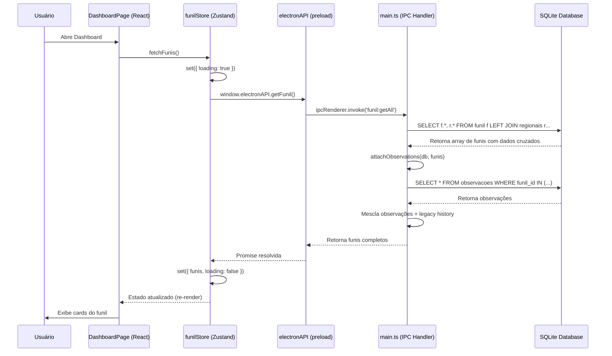
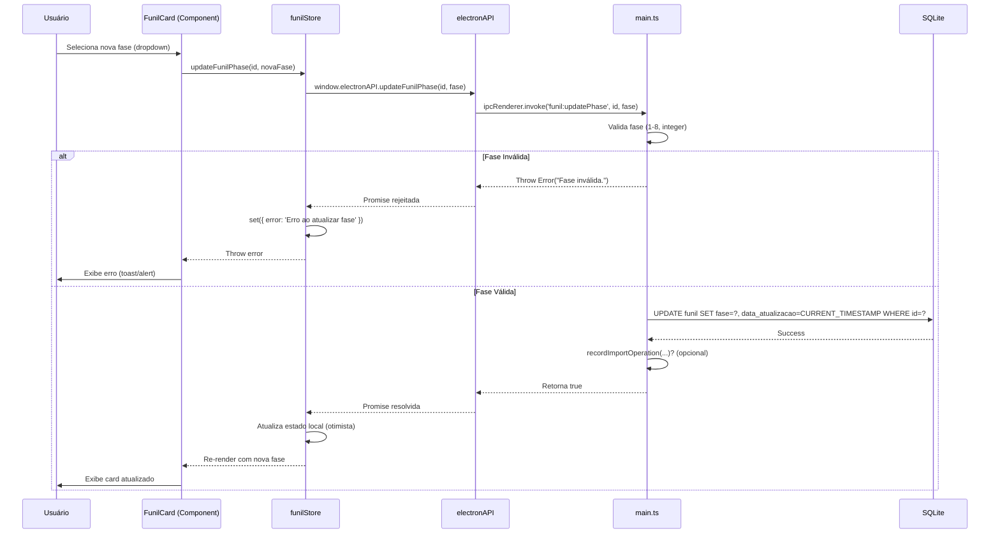
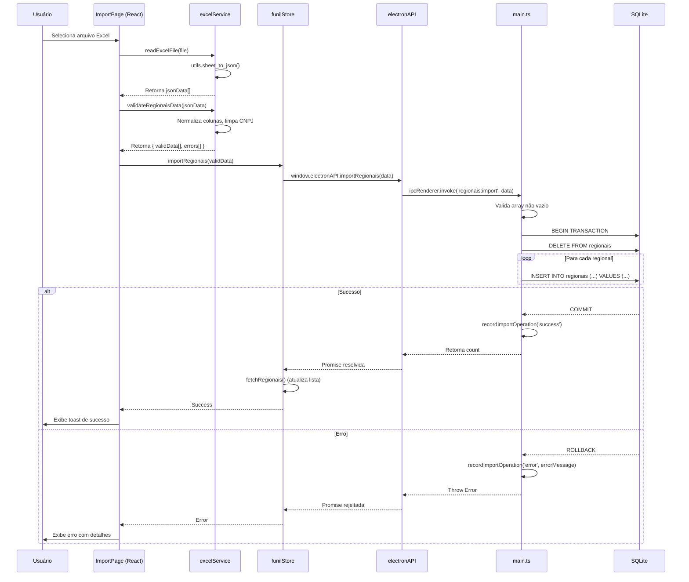
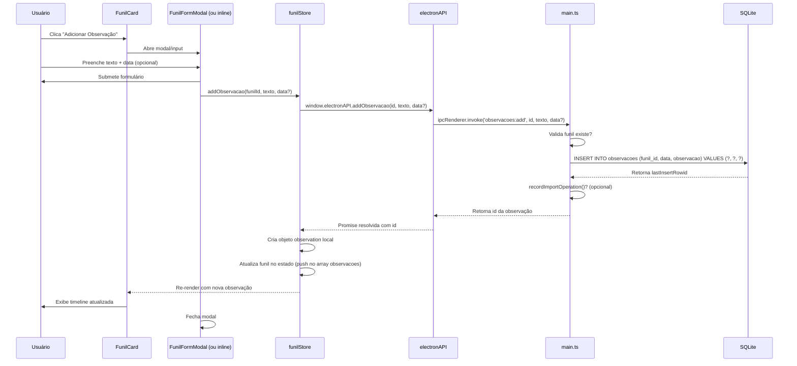
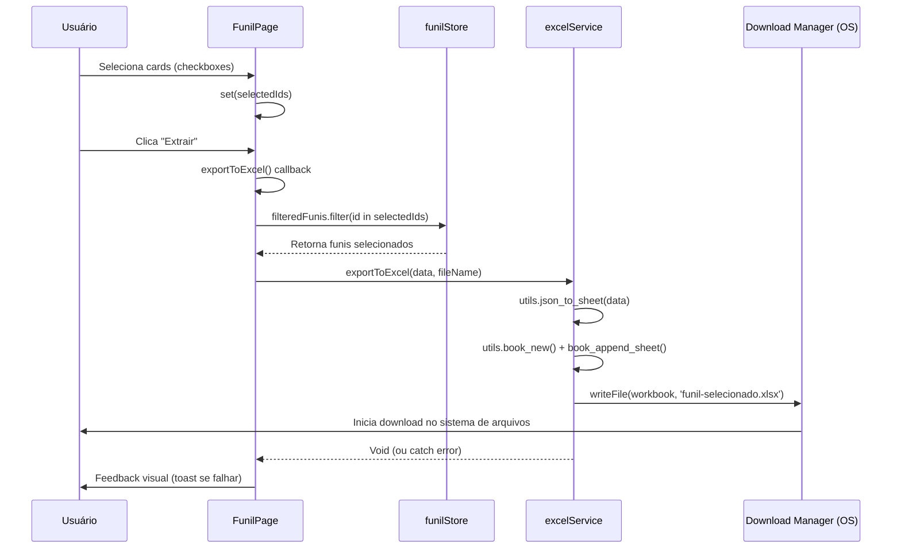

# Documento de Especificação Técnica (Spec)
## Sistema de Gestão de Funil Comercial - v1.0

---

## 1. Visão Geral e Objetivos

### 1.1 O Que É o Projeto
Sistema desktop de gestão de funil comercial desenvolvido com Electron, destinado ao acompanhamento e gerenciamento de oportunidades de negócio desde o mapeamento inicial até o fechamento (concluído ou declinado). A aplicação permite importação de dados via Excel, visualização em dashboard com métricas de SLA, e gestão detalhada de observações por oportunidade.

### 1.2 Problema Resolvido
- **Centralização de dados**: Elimina planilhas descentralizadas e versões conflitantes do funil comercial
- **Controle de SLA**: Monitora automaticamente o tempo de permanência em cada fase do funil
- **Rastreabilidade**: Mantém histórico completo de observações e movimentações de cada oportunidade
- **Integração de bases**: Cruza dados do funil com base de regionais (clientes, executivos, coordenadores)
- **Relatórios gerenciais**: Dashboard com métricas de potencial financeiro por fase e responsável

### 1.3 Público-Alvo
- Executivos de conta e gerentes comerciais
- Coordenadores de regionais
- Equipes de implantação e acompanhamento
- Gestores que necessitam de visão consolidada do pipeline comercial

---

## 2. Stack Tecnológico Sugerido

| Camada | Tecnologia | Justificativa |
|--------|-----------|---------------|
| **Frontend** | React 18 + TypeScript + Vite | Componentização, tipagem estática, build rápido e HMR para desenvolvimento |
| **UI Framework** | TailwindCSS | Estilização utilitária com suporte a temas (light/dark mode) |
| **Gerenciamento de Estado** | Zustand | Store minimalista e performática, sem boilerplate excessivo |
| **Runtime Desktop** | Electron 30+ | Aplicação nativa multiplataforma com acesso ao sistema de arquivos |
| **Banco de Dados** | SQLite (better-sqlite3) | Banco embutido, sem dependência de servidor, ideal para apps desktop |
| **Processamento Excel** | SheetJS (xlsx) | Leitura/escrita de arquivos Excel no renderer sem backend |
| **Ícones** | Lucide React | Biblioteca leve e moderna de ícones SVG |
| **Build Tool** | Vite + esbuild | Build otimizado para Electron com code splitting |

### 2.1 Dependências Principais (package.json)
```json
{
  "dependencies": {
    "react": "^18.x",
    "react-dom": "^18.x",
    "zustand": "^4.x",
    "better-sqlite3": "^9.x",
    "xlsx": "^0.18.x",
    "lucide-react": "^0.x"
  },
  "devDependencies": {
    "electron": "^30.x",
    "vite": "^5.x",
    "typescript": "^5.x",
    "tailwindcss": "^3.x"
  }
}
```

---

## 3. Arquitetura e Fluxo de Dados

### 3.1 Padrão Arquitetural
**Arquitetura em Camadas com Separação de Responsabilidades:**

```
┌─────────────────────────────────────────────────────────────┐
│                     Camada de Apresentação                   │
│  (React Components + Pages + TailwindCSS)                   │
│  - DashboardPage, FunilPage, ImportPage, FiltersPage        │
└─────────────────────────────────────────────────────────────┘
                            ↓ ↑
┌─────────────────────────────────────────────────────────────┐
│                  Gerenciamento de Estado (Zustand)           │
│  - funilStore, filterStore, themeStore, systemHealthStore   │
└─────────────────────────────────────────────────────────────┘
                            ↓ ↑
┌─────────────────────────────────────────────────────────────┐
│                 Context Bridge (preload.ts)                  │
│  - electronAPI exposto via contextBridge                    │
│  - IPC Renderer ↔ Main                                      │
└─────────────────────────────────────────────────────────────┘
                            ↓ ↑
┌─────────────────────────────────────────────────────────────┐
│                   Camada Principal (Electron Main)           │
│  - main.ts: IPC Handlers, janela BrowserWindow              │
│  - database.ts: Operações CRUD no SQLite                    │
│  - excelService.ts: Validação e normalização de dados       │
└─────────────────────────────────────────────────────────────┘
                            ↓ ↑
┌─────────────────────────────────────────────────────────────┐
│                    Banco de Dados (SQLite)                   │
│  - funil_comercial.db                                       │
│  - Tabelas: regionais, funil, observacoes, import_operations│
└─────────────────────────────────────────────────────────────┘
```

### 3.2 Padrões de Comunicação
- **IPC (Inter-Process Communication)**: Comunicação síncrona/assíncrona entre renderer e main process via `ipcRenderer.invoke` / `ipcMain.handle`
- **Context Isolation**: Habilitado no preload para segurança
- **Node Integration**: Desabilitado no renderer (princípio do menor privilégio)
- **Clean Architecture Adaptada**: Separação clara entre UI, lógica de negócio (store), e infraestrutura (database/Electron)

### 3.3 Fluxo de Dados Típico
1. **Usuário interage com UI** → Dispara action no Zustand store
2. **Store chama API do Electron** → `window.electronAPI.methodName()`
3. **Preload envvia via IPC** → `ipcRenderer.invoke('channel', data)`
4. **Main process executa no SQLite** → `db.prepare().run()/all()`
5. **Retorno sobe a cadeia** → Main → Preload → Store → UI (re-render)

---

## 4. Modelo de Dados (Schema)

### 4.1 Diagrama Entidade-Relacionamento

```mermaid
erDiagram
    REGIONAIS ||--o{ FUNIL : "cruzamento via CNPJ/id_cliente"
    FUNIL ||--o{ OBSERVACOES : "1:N"

    REGIONAIS {
        int id PK
        int ent_id_sap
        string cnpj
        string raiz
        string nome_cliente
        string desc_representante
        string desc_regional_matriz
        string executivo
        string email
        string nome_coordenador
    }

    FUNIL {
        int id PK
        string lumiax_genomica
        string responsavel
        string ticket_onboarding
        int id_cliente FK
        string cnpj
        string razao_social
        string nome_fantasia
        string uf
        string regional
        string ev
        string carteira
        string coordenador
        string gerente
        float potencial
        int fase (1-8)
        string entrada_mapeamento
        string saida_mapeamento
        int sla_mapeamento
        ... (campos repetidos para 8 fases)
        string observacao
        string historico
        string selecionados
        datetime data_criacao
        datetime data_atualizacao
    }

    OBSERVACOES {
        int id PK
        int funil_id FK
        datetime data
        string observacao
    }

    IMPORT_OPERATIONS {
        int id PK
        string operation
        string file_name
        int records
        string status (success/warning/error)
        string error_message
        datetime created_at
    }

    SYSTEM_ACCESS {
        int id PK (sempre = 1)
        datetime last_access_at
    }
```

### 4.2 Índices de Performance
```sql
-- Funil
CREATE INDEX idx_funil_id_cliente ON funil(id_cliente);
CREATE INDEX idx_funil_fase ON funil(fase);
CREATE INDEX idx_funil_cnpj ON funil(cnpj);
CREATE INDEX idx_funil_data_criacao ON funil(data_criacao DESC);
CREATE INDEX idx_funil_responsavel ON funil(responsavel);
CREATE INDEX idx_funil_ev ON funil(ev);

-- Regionais
CREATE INDEX idx_regionais_cnpj ON regionais(cnpj);
CREATE INDEX idx_regionais_cnpj_normalizado ON regionais(
  replace(replace(replace(replace(cnpj, '.', ''), '/', ''), '-', ''), ' ', '')
);

-- Observações
CREATE INDEX idx_observacoes_funil_id ON observacoes(funil_id);
CREATE INDEX idx_observacoes_funil_data ON observacoes(funil_id, data DESC, id DESC);

-- Import Operations
CREATE INDEX idx_import_operations_created_at ON import_operations(created_at DESC);
```

---

## 5. Escopo do MVP (Minimum Viable Product) - v1.0

### 5.1 Features Essenciais Implementadas

#### **Módulo 1: Gestão de Funil**
- [x] Listagem de todos os registros do funil em cards expansíveis
- [x] Cadastro manual de novo registro (modal com formulário completo)
- [x] Edição de registro existente
- [x] Exclusão individual e em lote (multi-seleção)
- [x] Movimentação de fase (1-8) com atualização de SLA
- [x] Histórico de observações por registro (timeline)
- [x] Adição de nova observação com data personalizada

#### **Módulo 2: Base de Regionais**
- [x] Importação de base de regionais via Excel (substitui tudo)
- [x] Validação de colunas e normalização de CNPJ
- [x] Cruzamento automático funil ↔ regional via CNPJ/id_cliente
- [x] Exibição de dados cruzados (executivo, coordenador, carteira)

#### **Módulo 3: Dashboard e Métricas**
- [x] Cards resumo: Potencial total, Quantidade de itens, Novos no mês
- [x] Gráfico de potencial por responsável (top 5)
- [x] Distribuição de itens por fase do funil
- [x] Cálculo de SLA médio por fase
- [x] Filtros globais no dashboard (negócio, regional, fase, responsável, executivo, carteira)

#### **Módulo 4: Importação/Exportação**
- [x] Importação de funil legado (base antiga) via Excel
- [x] Validação e normalização de dados legados
- [x] Prevenção de duplicidade por CNPJ ou ID cliente
- [x] Exportação de registros selecionados para Excel
- [x] Template para importação de observações em lote

#### **Módulo 5: Saúde do Sistema**
- [x] Dashboard de saúde: tamanho do DB, contagem de registros
- [x] Validação de integridade (CNPJs faltantes, regionais não encontradas)
- [x] Histórico de operações de importação (sucesso/erro)
- [x] Controle de último acesso ao sistema

#### **Módulo 6: Filtros e Busca**
- [x] Filtros dinâmicos habilitáveis/desabilitáveis (FilterStore)
- [x] Busca textual global em múltiplos campos
- [x] Paginação por "carregar mais" (scroll infinito simulado)
- [x] Ordenação por colunas (potencial, SLA, responsável, etc.)

#### **Módulo 7: UX/UI**
- [x] Tema claro/escuro (persistido em localStorage)
- [x] Animações de fade-in (FadeIn component)
- [x] Loading skeletons durante fetch de dados
- [x] Feedback visual de seleção em lote
- [x] Modal reutilizável com portal

---

## 6. Features Futuras (Backlog) - v2.0

### 6.1 Melhorias de Funcionalidade
- [ ] **Autenticação e Multi-usuário**: Login com níveis de permissão (admin, gestor, viewer)
- [ ] **Sincronização em Nuvem**: Backup automático em Google Drive/OneDrive ou backend dedicado
- [ ] **Notificações Push**: Alertas de SLA prestes a vencer (integração com sistema de notificação do OS)
- [ ] **Relatórios PDF**: Geração de relatórios gerenciais em PDF com gráficos
- [ ] **Webhooks**: Integração com CRM externo (Salesforce, Pipedrive, HubSpot)
- [ ] **Histórico de Mudanças**: Audit log de quem alterou qual campo e quando
- [ ] **Comentários em Tempo Real**: Colaboração simultânea em observações (WebSocket)
- [ ] **Campos Personalizados**: Admin pode criar campos extras por tipo de negócio

### 6.2 Melhorias Técnicas
- [ ] **Migração para TypeScript Estrito**: Remover `any` residual
- [ ] **Testes Automatizados**: Jest + React Testing Library + Playwright para E2E
- [ ] **CI/CD Pipeline**: GitHub Actions para build e publicação automática
- [ ] **Auto-update**: Electron updater para distribuição de novas versões
- [ ] **Logs Estruturados**: Winston + rotação de logs para debugging em produção
- [ ] **Monitoramento**: Sentry ou similar para tracking de erros em tempo real
- [ ] **Otimização de Queries**: Prepared statements com cache para queries frequentes
- [ ] **Virtualização de Lista**: React-window para renderizar milhares de cards sem lag

### 6.3 Analytics Avançado
- [ ] **Previsão de Fechamento**: ML simples baseado em histórico de conversão por fase
- [ ] **Funil de Conversão**: Taxa de conversão entre fases com comparação temporal
- [ ] **Heatmap de SLA**: Identificação visual de gargalos no processo
- [ ] **Exportação para BI**: Conexão direta com Power BI/Tableau via ODBC

---

## 7. Regras de Negócio e Restrições

### 7.1 Regras de Negócio Críticas

#### **RN001 - Unicidade de Registro**
- Não permitir duplicidade de funil por CNPJ OU ID cliente
- Validação realizada antes do INSERT no banco
- Mensagem de erro clara: "Já existe um registro do funil com este CNPJ ou cliente."

#### **RN002 - Fases do Funil (1-8)**
- Fase é inteiro entre 1 e 8 (validação no `updatePhase`)
- Mapeamento:
  1. Mapeamento
  2. Proposta
  3. Negociação
  4. Contrato
  5. Implantação
  6. Acompanhamento (60 Dias)
  7. Declinou
  8. Concluído

#### **RN003 - Cálculo de SLA**
- SLA = diferença em dias entre `data_criacao` e data atual (ou data de saída da fase)
- Campos `sla_*` armazenam valor inteiro (dias)
- Dashboard calcula média aritmética dos SLAs por fase

#### **RN004 - Cruzamento de Dados**
- Prioridade: `id_cliente` (FK para regionais.id) > CNPJ normalizado
- Se regional não encontrada, mantém dados originais do funil
- Campos cruzados: `regional_cruzada`, `carteira_cruzada`, `executivo_regional`, `coord_regional`

#### **RN005 - Importação de Regionais**
- Operação "slot": apaga toda a tabela e reinsere (não faz merge)
- Validação mínima: CNPJ OU nome_cliente OU ID devem estar presentes
- Rollback automático em caso de erro em qualquer linha

#### **RN006 - Importação de Funil Legado**
- Ignora registros com CNPJ ou ID cliente já existentes
- Normaliza datas para formato ISO (`YYYY-MM-DD`)
- Converte histórico multi-linha para observações individuais

#### **RN007 - Observações**
- Pode ser adicionada com data retroativa
- Histórico legado (`historico` field) é parseado e exibido junto com observações persistidas
- Prioridade: observações na tabela `observacoes` > histórico legado

### 7.2 Restrições Técnicas

#### **RT001 - Segurança**
- `nodeIntegration: false` no BrowserWindow
- `contextIsolation: true` obrigatório
- Preload script expõe apenas APIs necessárias via `contextBridge`
- Sem execução de código arbitrário no renderer

#### **RT002 - Performance**
- Limite de 40 cards renderizados inicialmente (pagination "load more")
- Índices em todas as colunas de filtro e join
- Query única para observações (evita N+1) via `attachObservations()`
- Memoização de filtros e stats com `useMemo` no React

#### **RT003 - Banco de Dados**
- SQLite versão 3.x compatível com better-sqlite3
- Foreign keys habilitadas (`PRAGMA foreign_keys = ON`)
- Path do DB: `app.getPath('userData')` (isolado por usuário OS)
- Backup manual necessário (não há auto-backup)

#### **RT004 - Compatibilidade**
- Windows 10+, macOS 10.13+, Linux (distros com glibc 2.17+)
- Node.js 18+ (compatível com Electron 30)
- Resolução mínima: 1024x768

#### **RT005 - Compliance**
- Dados sensíveis (CNPJ, nomes) armazenados localmente
- Sem transmissão de dados para servidores externos
- LGPD: usuário é responsável pelo backup e exclusão de dados

### 7.3 Tratamento de Erros

| Cenário | Comportamento | Mensagem ao Usuário |
|---------|--------------|---------------------|
| Importação Excel vazia | Rejeita arquivo | "Arquivo vazio ou sem dados válidos" |
| CNPJ duplicado | Rollback da linha | "Já existe um registro do funil com este CNPJ ou cliente." |
| Regional não encontrada | Mantém dados originais | (sem erro, só não cruza) |
| Falha no DB | Log no import_operations | "Erro ao buscar funis" (toast/alert) |
| Fase inválida (<1 ou >8) | Throw exception | "Fase inválida." |

---

## 8. Diagramas de Sequência

### 8.1 Fluxo: Carregar Funil no Dashboard



### 8.2 Fluxo: Atualizar Fase do Funil



### 8.3 Fluxo: Importar Base de Regionais



### 8.4 Fluxo: Adicionar Observação



### 8.5 Fluxo: Exportar Funis Selecionados para Excel



---

## 9. Considerações Finais

### 9.1 Pontos Fortes da Arquitetura Atual
- ✅ **Offline-first**: Funciona sem internet, dados locais
- ✅ **Performance**: SQLite + índices + memoização
- ✅ **Segurança**: Context isolation, sem nodeIntegration
- ✅ **Manutenibilidade**: Código modular, stores separadas por domínio
- ✅ **UX**: Feedback visual, loading states, animações

### 9.2 Dívidas Técnicas Identificadas
- ⚠️ Uso de `any` em alguns tipos (ex: `funil: any` no store)
- ⚠️ Testes automatizados ausentes
- ⚠️ Logs de erro não estruturados (apenas console.error)
- ⚠️ Sem tratamento para concorrência (dois usuários editando mesmo registro)
- ⚠️ Hardcode de caminhos e configurações

### 9.3 Recomendações para Próximas Iterações
1. **Prioridade Alta**: Implementar testes unitários nas stores e services
2. **Prioridade Média**: Adicionar logging estruturado (Winston)
3. **Prioridade Baixa**: Migrar para TypeScript strict mode
4. **Nice-to-have**: Adicionar atalhos de teclado para ações frequentes

---

**Documento Versão**: 1.0
**Última Atualização**: {{CURRENT_DATE}}
**Responsável**: Tech Lead / Product Manager
**Status**: Aprovado para Desenvolvimento
